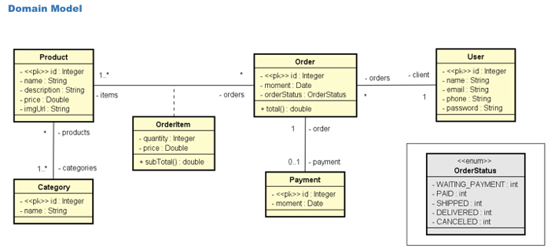
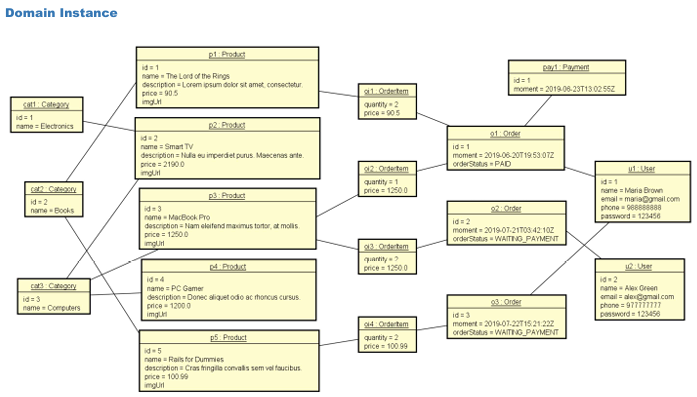
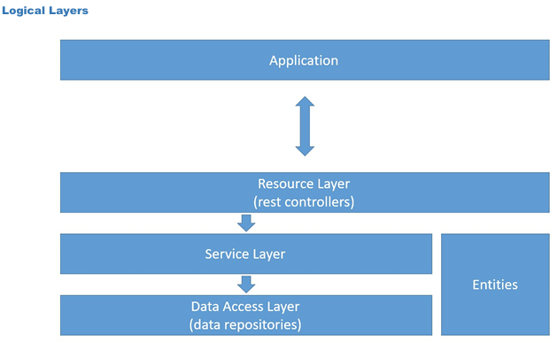

 

 

@author Daniel Gil

# Spring Boot e JPA / Hibernate

## Objetivos 
- Criar projeto Spring Boot Java 
- Implementar modelo de domínio 
- Estruturar camadas lógicas: resource, service, repository 
- Configurar banco de dados de teste (H2) 
- Povoar o banco de dados 
- CRUD - Create, Retrieve, Update, Delete 
- Tratamento de exceções

### UML:

  

### Relacionamentos

  

### Camadas da Aplicação

  

## Project created 
#### Checklist: 
- User entity and resource 
## Basic entity checklist: 
- Basic attributes 
- Associations (instantiate collections) 
- Constructors 
- Getters & Setters (collections: only get) 
- hashCode & equals 
- Serializable 

## H2 database, test profile, JPA 
#### Checklist: 
- JPA & H2 dependencies 
- application.properties 
- application-test.properties 
- Entity: JPA mapping 

##### Dependencies
##### application.properties
##### application-test.properties

## JPA repository, dependency injection, database seeding 
#### Checklist: 
- UserRepository extends JPARepository<User, Long> 
- Configuration class for "test" profile 
- @Autowired UserRepository 
- Instantiate objects in memory 
- Persist objects

## Service layer, component registration 
## Order, Instant, ISO 8601 
### Basic new entity checklist: 
- Entity 
	- "To many" association, lazy loading, JsonIgnore 
- Repository 
- Seed 
- Service 
- Resource

## OrderStatus enum 
## Category
## Product 
## Many-to-many association with JoinTable 
## OrderItem, many-to-many association with extra atributes
### Checklist: 
- OrderItemPK 
- OrderItem 
- Order one-to-many association 
- Seed

## Product-OrderItem one-to-many association 
## Payment, one-to-one association 
## Subtotal & Total methods 
## User insert
#### Checklist: 
- UserService 
- UserResource

## User delete 
#### Checklist: 
- UserService 
- UserResource 
  
## User update 
#### Checklist: 
- UserService 
- UserResource

## Exception handling - findById 
#### Checklist: 
- NEW CLASS: services.exceptions.ResourceNotFoundException 
- NEW CLASS: resources.exceptions.StandardError 
- NEW CLASS: resources.exceptions.ResourceExceptionHandler 
- UserService 
 
## Exception handling - delete 
#### Checklist: 
- NEW CLASS: services.exceptions.DatabaseException 
- ResourceExceptionHandler 
- UserService 
	- EmptyResultDataAccessException 
	- DataIntegrityViolationException 

## Exception handling - update 
#### Checklist: 
- UserService 
	- EntityNotFoundException